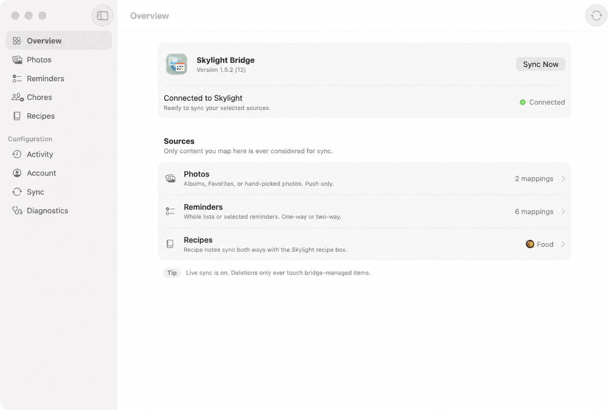

<p align="center">
  
</p>

<h1 align="center">Skylight Bridge for macOS</h1>

<p align="center">
  <strong>Keep your Skylight Calendar useful with the Apple Photos, Reminders, and recipes you choose on your Mac.</strong>
</p>

<p align="center">
  <code>macOS 26+</code> &bull; <code>opt-in mappings</code> &bull; <code>notarized updates</code>
</p>

<p align="center">
  <a href="https://github.com/oliverames/skylight-bridge/releases/tag/v1.6.4">
    
  </a>
  <a href="#license">
    
  </a>
  <a href="#ios-companion">
    
  </a>
  <a href="https://www.buymeacoffee.com/oliverames">
    
  </a>
</p>

---

Skylight Bridge is a native macOS app for households that use a Skylight Calendar alongside Apple Photos, Apple Reminders, and Apple Notes. It mirrors only the albums, lists, folders, recipes, and individual photos you explicitly select. Photos remain one-way from Apple, while Reminders, recipes, and chores can be linked in both directions.

The Mac app is Developer ID-signed, notarized, and independently maintained. It is not affiliated with Skylight, and it uses a private Skylight API that can change without notice.

## Why a bridge exists

Skylight works best when it reflects the household's actual routines. The trouble is that those routines usually already live elsewhere: the family photo library, a Reminders list, a recipe folder, or the chore chart everyone checks on a phone.

Without a bridge, keeping a Skylight Calendar current means maintaining the same information twice. Skylight Bridge handles the repeat work while leaving control with the person who owns the Apple data. A shared screen stays useful, and no one has to upload the same photo or retype the same task again.

This is a practical Mac utility, not a second household database. Every mapping is opt-in, and the Activity screen gives you a clear record of what the bridge changes.

## Install on macOS

1. Go to the [latest macOS release](https://github.com/oliverames/skylight-bridge/releases/latest) and download the `.dmg` file.
2. Open the downloaded disk image and drag **Skylight Bridge** into **Applications**.
3. Open Skylight Bridge from Applications. The app is Developer ID-signed, notarized, and stapled for Gatekeeper.
4. The app checks for signed updates, and **Skylight Bridge > Check for Updates…** is always available when you want to check manually.

Version 1.6.4 adds photo previews to the selected-photo editor, fixes authentication with plus signs, preserves selected-photo edits across restarts, and keeps completed recurring chores stable through later syncs and edits. It also improves reminder adoption, Notes save failures, and cleanup retries. The [September 4 bug review](docs/BUG_REVIEW_2026-09-04.md) records the findings and verification. If you want to verify the download, compare the output below with the checksum file beside the DMG on the release page.

```bash
shasum -a 256 ~/Downloads/Skylight.Bridge-1.6.4.dmg
```

<p align="center">
  
</p>

<p align="center">
  <sub>One Mac workspace for the selected parts of your Apple life that belong on a shared Skylight Calendar.</sub>
</p>

## First sync

1. Open **Account** and sign in to your Skylight account. The app finds available frames and devices.
2. Add and enable the source you want in Photos, Reminders, Chores, or Recipes. Grant only the Apple permissions that source needs.
3. Select **Sync Now**, then use **Activity** to review the result. The overview always shows which sources are ready to sync.

The menu bar keeps the app close at hand. It shows sync status, runs a sync when the app is ready, and directs you to sign in, configure a mapping, or inspect Activity when that is the next useful step. You can also run sync automatically every 10 to 240 minutes, launch the app at login, or keep it in the menu bar without a Dock icon.

## What Skylight Bridge can map

### Apple Photos to Skylight albums

Map an album, folder, shared album, Favorites, another smart album, or selected individual photos to a Skylight album. You choose exactly what is included, so Skylight Bridge never uploads the whole library.

The app renders edited RAW, ProRAW, HEIC, HDR, and wide-gamut assets as displayable sRGB JPEGs. For individually selected photos, Apple Intelligence can create a concise name on your Mac after the picker closes. That local name becomes the caption on the bridge-linked Skylight copy without renaming or changing the photo in Apple Photos.

Apple Photos remains one-way to Skylight. The bridge never edits or deletes the original photo library. Generated selected-photo names are local bridge labels, not Apple Photos titles, and are published only as captions on bridge-linked Skylight copies. For a selected photo, the bridge can remove only the Skylight copy that it created and recorded as its own.

### Apple Reminders and Skylight lists

Map an entire list or selected reminders in either direction. Two-way mappings preserve additions from both sides, adopt matching items instead of duplicating them, and keep linked list titles and colors in sync after the first baseline. If the same field changes in both places, the mapping follows your selected conflict policy.

Renaming a linked list does not break the mapping. Skylight Bridge retains the relationship and updates the list already connected on the other side.

### Apple Notes and Skylight Recipe Box

Map a recipe folder or selected recipe notes to Skylight's Recipe Box. Skylight Bridge parses each recipe into its title, description, servings, prep and cook times, ingredients, instructions, tags, and source URL.

With the **Automatic** recipe setting, Apple Intelligence runs on your Mac to choose the best existing Skylight category and add a fitting emoji when the title needs one. Recipe content stays on the Mac for this classification. If Apple Intelligence is unavailable, the recipe still syncs without automatic classification.

For two-way recipe sync, Skylight Bridge can create notes from new Skylight recipes and update linked notes after changes. It formats those notes with a title heading, section headings, native ingredient bullets, and numbered instruction lists. Notes with attachments are never rewritten.

### Skylight Chore Chart and Apple Reminders

Connect the Skylight Chore Chart with an Apple Reminders list for each selected household member. The app creates or reuses the list and keeps the mapping two-way.

Recurring chores remain recurring in Reminders. Completing or reopening a chore on either side updates that day's occurrence on the other.

## What stays under your control

| Setting or safeguard | How it works |
| --- | --- |
| Selection | Nothing syncs until you create and enable a mapping. Unselected albums, lists, notes, folders, and photos stay out of scope. |
| Preview mode | The app plans and logs changes without applying them until you explicitly switch to live sync. |
| Deletion | Bridge-managed cleanup is limited to Skylight records the app created or explicitly adopted. It does not delete manual Skylight content. |
| Photos privacy | Exports use the current edited appearance, preserve aspect ratio, convert to sRGB JPEG, and remove GPS and XMP metadata by default. |
| Notes safety | Apple Notes change only when you explicitly enable two-way recipe sync. Notes with attachments are never rewritten. |
| Selected-photo names | On supported Macs, Apple Intelligence generates a name only after you have finished selecting the photo. The name stays with the local mapping, becomes the caption of its bridge-linked Skylight copy, and is never written to Apple Photos. |
| Credentials | Skylight credentials and OAuth tokens stay in the macOS Keychain, not in configuration files or logs. |
| iCloud | The private CloudKit database stores shared preferences and individual-photo mapping metadata. It never stores Skylight credentials or Apple Notes content. If iCloud sharing cannot save because its production schema needs deployment, the app keeps the local change and records a clear retry message in Activity. |

There is deliberately no calendar sync interface. Google Calendar already covers that need well. Routines and Task Box are also outside the product interface.

## Free to use, supported when it has earned it

Skylight Bridge is a free Mac app. After it has actually applied 50, 500, 2,000, or 10,000 changes between your selected Apple sources and Skylight, it may offer a Buy Me a Coffee link. The prompt names the number of changes it has completed, appears only while the app is connected and idle, and is spaced at least 30 days apart. **Don't Ask Again** turns it off permanently.

This is a Mac-only, optional support prompt. It uses the local sync total to show the value the bridge has delivered, and it does not use an App Store donation flow.

## iOS companion

An iOS companion app is in development. It will let people manage shared preferences and selected individual-photo mappings from an iPhone, with private CloudKit reconciliation between the phone and Mac.

The Mac remains the Skylight authentication and synchronization engine. The iOS app will not offer Apple Notes folder access because iOS does not provide a public API for that part of Apple Notes. It is not yet a public App Store or TestFlight release.

## Requirements

| Requirement | Notes |
| --- | --- |
| macOS | macOS 26 or later |
| On-device selected-photo names | macOS 27 or later with Apple Intelligence available on the Mac. The rest of the app continues to run on macOS 26 or later. |
| Skylight account | Required to discover frames, devices, and destinations |
| Skylight subscription | Required only for the Skylight features your account uses |
| Apple permissions | Photos, Reminders, and Apple Events access are requested only for the sources you configure |
| Network access | Needed to connect to Skylight and download iCloud-only photo originals when selected |

## Questions people ask

### Does Skylight Bridge copy my entire photo library or every Reminders list?

No. You choose each mapping. The app does not start with a whole-library import or a blanket list sync.

### Can it delete my original Apple photos?

No. Apple Photos is source-only. Removing a photo mapping can remove a bridge-created Skylight copy, but it does not alter the original photo in Apple Photos.

### Will selected-photo names rename photos in Apple Photos?

No. The name is a local label for a hand-picked photo in Skylight Bridge. It is generated only after selection finishes, becomes the caption of its bridge-linked Skylight copy, and does not change the Apple Photos title, metadata, or library.

### Is Skylight Bridge an official Skylight app?

No. Skylight Bridge is an independent project by Oliver Ames. Skylight does not publish a supported public API, so changes on Skylight's side can affect compatibility.

### Does it work on iPhone?

The native iOS companion is in development. The released Mac app is the supported client today.

### Can I sync Google Calendar through Skylight Bridge?

No. The product intentionally does not add a calendar sync layer where Google Calendar already provides one.

## Build and development

The source tree requires Swift 6.4 or later, macOS 26, access to the private `skylight-bridge-ios` Swift package, and the Apple development credentials needed for a signed local app.

```bash
git clone https://github.com/oliverames/skylight-bridge.git
cd skylight-bridge
./script/run_tests.sh
./script/build_and_run.sh --verify
```

The test suite covers sync planning, recurrence conversion, parsers, authentication, configuration compatibility, and API request contracts. The local run script verifies the signed bundle before it launches the app.

For deeper technical detail, read the [product specification](docs/PRODUCT_SPEC.md) and [API evidence and compatibility notes](docs/API_EVIDENCE.md).

## License

All rights reserved. This repository is source available for evaluation and reference only. No license is granted to copy, modify, distribute, or operate the software without permission from Oliver Ames.

---

<p align="center">
  <a href="https://www.buymeacoffee.com/oliverames">
    
  </a>
</p>

<p align="center">
  <sub>
    Built by <a href="https://ames.consulting">Oliver Ames</a> in Vermont
    &bull; <a href="https://github.com/oliverames">GitHub</a>
    &bull; <a href="https://linkedin.com/in/oliverames">LinkedIn</a>
    &bull; <a href="https://bsky.app/profile/oliverames.bsky.social">Bluesky</a>
  </sub>
</p>
